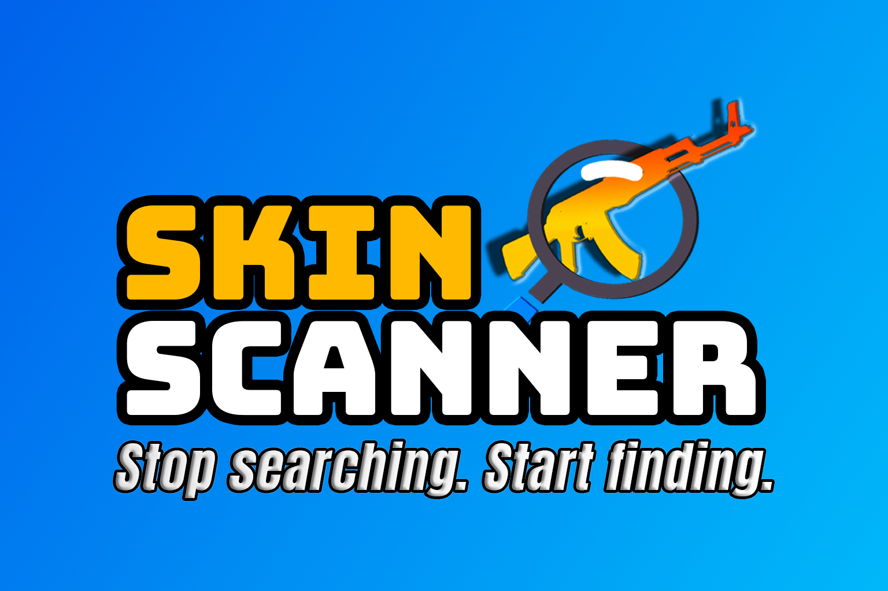

  

# SkinScanner 🔍 

**Stop Searching. Start Finding.**  
The ultimate CS2 multi-market skin search extension — by [Dadscap](https://www.youtube.com/@dadscap).

---

## 🌟 What it does
SkinScanner lets you instantly search for any CS2 skin across all major marketplaces — with filters for float, paint seed, StatTrak, trade hold, and more.

**No sign-up. No limits. No tracking.** Just fast, frictionless skin searches — the way it should be.

---

## 🛠️ Features
- Multi-market search (Steam, BUFF163, Skinport, CSFloat & more!)
- Float range + Paint Seed filters
- StatTrak & Tradable toggles
- Light/Dark mode UI
- **Free to use — unlimited searches, no login required**

---

## 📦 Installation
1. Download the extension files
2. Go to `chrome://extensions`
3. Enable "Developer Mode"
4. Click **Load Unpacked** and select the `/src` folder

---

## 🤝 License
MIT License.  
Referral links are included in the official release by Dadscap.

---

## 💬 Contact
For questions, suggestions, or collabs: [dadscaptv@gmail.com](mailto:dadscaptv@gmail.com) or [@Dadscap](https://twitter.com/dadscap) on Twitter
